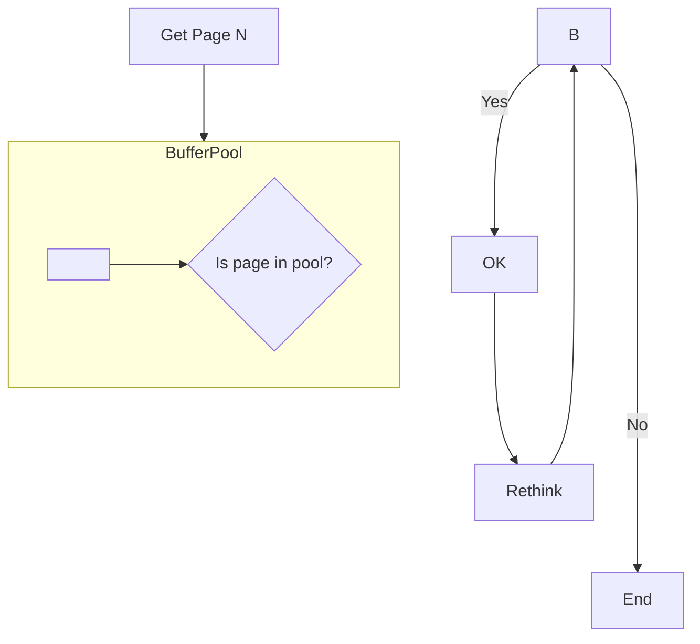

```mermaid
flowchart TD
    r1[Get Page N] --> bp
    subgraph bp [BufferPool]
        beg[ ] --> req{Is page in pool?}
    end
    B -- Yes --> C[OK]
    C --> D[Rethink]
    D --> B
    B -- No ----> E[End]
    
```