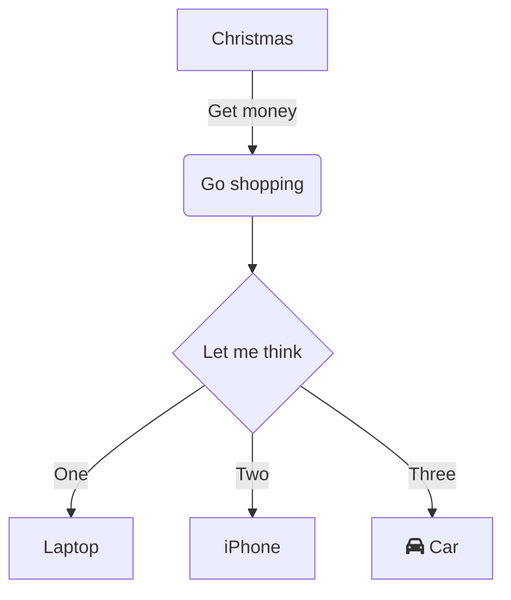
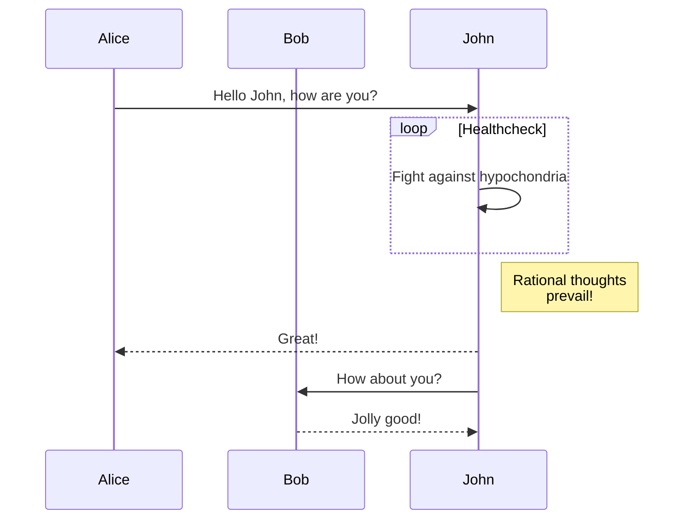

# Storage Engine Architecture
Lorem ipsum dolor sit amet, consectetur adipiscing elit. Praesent libero turpis, aliquam \
quis consequat ac, volutpat et arcu. Nullam varius, ligula eu venenatis dignissim, lectus \
ligula ullamcorper odio, in rhoncus nisi nisl congue sem. In hac habitasse platea dictumst. \
Donec sem est, rutrum ut libero nec, placerat vehicula neque.

Nulla mollis dictum nunc, ut viverra ex. Nam ac lacus at quam rhoncus finibus. Praesent \
efficitur, ante eget eleifend scelerisque, neque erat malesuada neque, vel euismod dui leo \
a nisl. Donec a eleifend dui. Maecenas nec leo odio. In maximus convallis ligula eget sodales. \
Nullam a mi hendrerit, finibus dolor eu, pellentesque ligula. Proin ultricies vitae neque sit \
amet tempus.

## Table of Contents
 - [Basic Overview](#basic-overview)
 - [Types](#types)
 - [Access Level API](#access-level-api)
 - [Components](#components)
   - [Page Cache](#page-cache)
   - [Disk Manager](#disk-manager)
   - [File Layout](#file-layout)

## Basic Overview
Lorem ipsum dolor sit amet, consectetur adipiscing elit. Praesent libero turpis, aliquam \
quis consequat ac, volutpat et arcu. Nullam varius, ligula eu venenatis dignissim, lectus \
ligula ullamcorper odio, in rhoncus nisi nisl congue sem. In hac habitasse platea dictumst. \
Donec sem est, rutrum ut libero nec, placerat vehicula neque.
```go

```

## Types
\
***Page***
```go
type Page []byte
```
The `Page` is a slice of bytes. This implementation is a slotted page implementation. The\
default page size is 16KB, but can be reconfigured if necessary. It should be noted that \
the page size is the maximum upper bound limit for a single record. A page is thread safe.\
\
\
***Frame***
```go
type Frame struct {
    PID       uint32    // id of this page
    FID       uint32    // id or index of this frame
    PinCount  uint32    // how many threads are using this frame
    IsDirty   bool      // page data that has been modified, but not yet flushed to disk
    Page                // embedded page data
}
```
The `Frame` is a page frame in the buffer pool. It is a placeholder in the buffer pool for\
storing page data and meta information about what is happening with the page.\
\
\
***DiskManager***
```go
type PageCache struct {
    latch     sync.Mutex                    // latch for safety
    pool      []Frame                       // set of page frames
    replacer  *ClockReplacer                // page replacement policy structure
    disk      *DiskManager                  // underlying file manager
    freeList  []frame.FrameID               // list of frames that are free to use
    pageTable map[page.PageID]frame.FrameID // Page to Frame mappings
}
```
The `PageCache` holds the buffer pool, the page table mappings, the free list and the\
replacement policy algorithm.\
\
\
***PageCache***
```go
type PageCache struct {
    latch     sync.Mutex                    // latch for safety
    pool      []Frame                       // set of page frames
    replacer  *ClockReplacer                // page replacement policy structure
    disk      *DiskManager                  // underlying file manager
    freeList  []frame.FrameID               // list of frames that are free to use
    pageTable map[page.PageID]frame.FrameID // Page to Frame mappings
}
```
The `PageCache` holds the buffer pool, the page table mappings, the free list and the\
replacement policy algorithm.\
\
\

## Access Level API
Nulla mollis dictum nunc, ut viverra ex. Nam ac lacus at quam rhoncus finibus. Praesent \
efficitur, ante eget eleifend scelerisque, neque erat malesuada neque, vel euismod dui leo \
a nisl. Donec a eleifend dui. Maecenas nec leo odio. In maximus convallis ligula eget sodales. \
Nullam a mi hendrerit, finibus dolor eu, pellentesque ligula. Proin ultricies vitae neque sit \
amet tempus.
```go

```

## Components
In the sections below, we will go over the basic components that work together to make \
up the storage engine as a whole.
```go

```

### Page Cache
Nulla mollis dictum nunc, ut viverra ex. Nam ac lacus at quam rhoncus finibus. Praesent \
efficitur, ante eget eleifend scelerisque, neque erat malesuada neque, vel euismod dui leo \
a nisl.
```go

```

### Disk Manager
Donec a eleifend dui. Maecenas nec leo odio. In maximus convallis ligula eget sodales. \
Nullam a mi hendrerit, finibus dolor eu, pellentesque ligula. Proin ultricies vitae neque sit \
amet tempus.
```go

```

### File Layout
Nulla mollis dictum nunc, ut viverra ex. Nam ac lacus at quam rhoncus finibus. Praesent \
efficitur, ante eget eleifend scelerisque, neque erat malesuada neque, vel euismod dui leo \
a nisl.
```go

```





