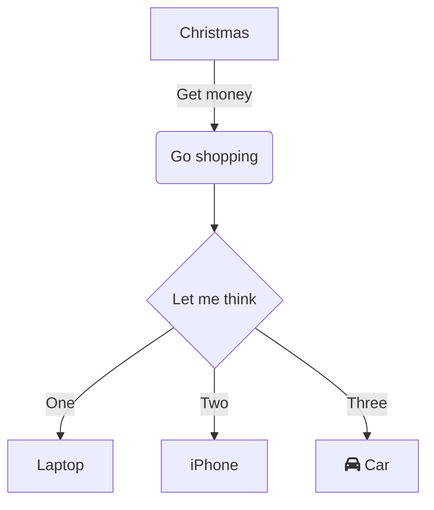
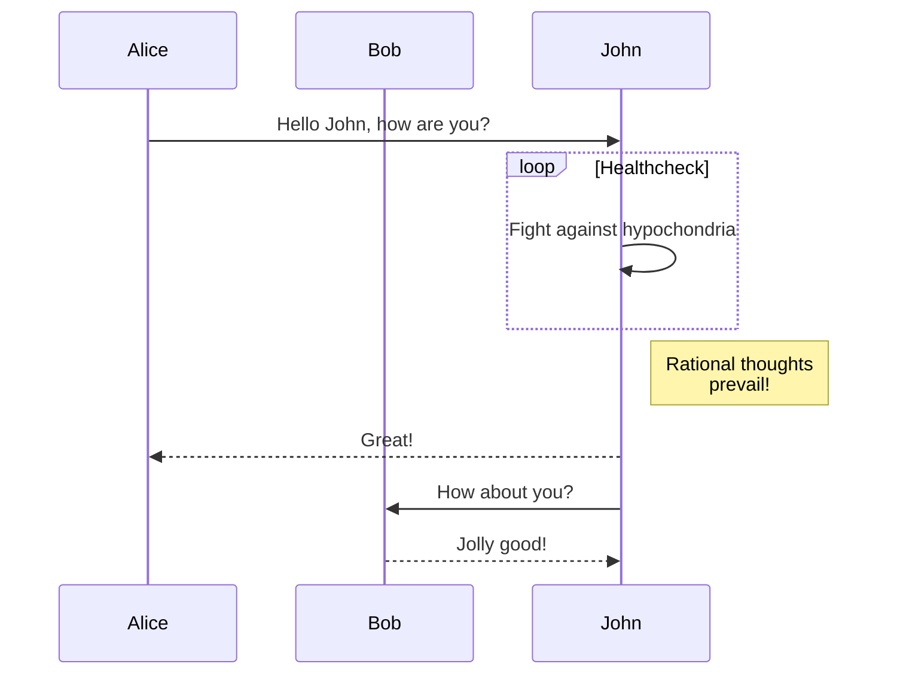

# Storage Engine Architecture
Lorem ipsum dolor sit amet, consectetur adipiscing elit. Praesent libero turpis, aliquam \
quis consequat ac, volutpat et arcu. Nullam varius, ligula eu venenatis dignissim, lectus \
ligula ullamcorper odio, in rhoncus nisi nisl congue sem. In hac habitasse platea dictumst. \
Donec sem est, rutrum ut libero nec, placerat vehicula neque.

Nulla mollis dictum nunc, ut viverra ex. Nam ac lacus at quam rhoncus finibus. Praesent \
efficitur, ante eget eleifend scelerisque, neque erat malesuada neque, vel euismod dui leo \
a nisl. Donec a eleifend dui. Maecenas nec leo odio. In maximus convallis ligula eget sodales. \
Nullam a mi hendrerit, finibus dolor eu, pellentesque ligula. Proin ultricies vitae neque sit \
amet tempus.

## Table of Contents
 - [Basic Overview](#basic-overview)
 - [Access Level API](#access-level-api)
 - [Components](#components)
   - [Page Cache](#page-cache)
   - [Disk Manager](#disk-manager)
   - [File Layout](#file-layout)

## Basic Overview
Lorem ipsum dolor sit amet, consectetur adipiscing elit. Praesent libero turpis, aliquam \
quis consequat ac, volutpat et arcu. Nullam varius, ligula eu venenatis dignissim, lectus \
ligula ullamcorper odio, in rhoncus nisi nisl congue sem. In hac habitasse platea dictumst. \
Donec sem est, rutrum ut libero nec, placerat vehicula neque.
```go

```

## Access Level API
Nulla mollis dictum nunc, ut viverra ex. Nam ac lacus at quam rhoncus finibus. Praesent \
efficitur, ante eget eleifend scelerisque, neque erat malesuada neque, vel euismod dui leo \
a nisl. Donec a eleifend dui. Maecenas nec leo odio. In maximus convallis ligula eget sodales. \
Nullam a mi hendrerit, finibus dolor eu, pellentesque ligula. Proin ultricies vitae neque sit \
amet tempus.
```go

```

## Components
In the sections below, we will go over the basic components that work together to make \
up the storage engine as a whole.
```go

```

### Page Cache
Nulla mollis dictum nunc, ut viverra ex. Nam ac lacus at quam rhoncus finibus. Praesent \
efficitur, ante eget eleifend scelerisque, neque erat malesuada neque, vel euismod dui leo \
a nisl.
```go

```

### Disk Manager
Donec a eleifend dui. Maecenas nec leo odio. In maximus convallis ligula eget sodales. \
Nullam a mi hendrerit, finibus dolor eu, pellentesque ligula. Proin ultricies vitae neque sit \
amet tempus.
```go

```

### File Layout
Nulla mollis dictum nunc, ut viverra ex. Nam ac lacus at quam rhoncus finibus. Praesent \
efficitur, ante eget eleifend scelerisque, neque erat malesuada neque, vel euismod dui leo \
a nisl.
```go

```





